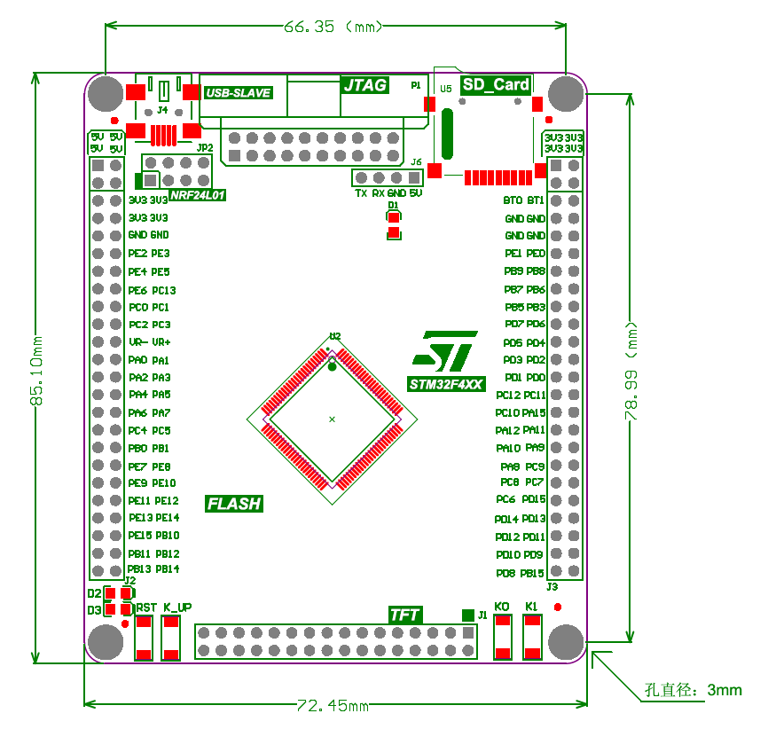
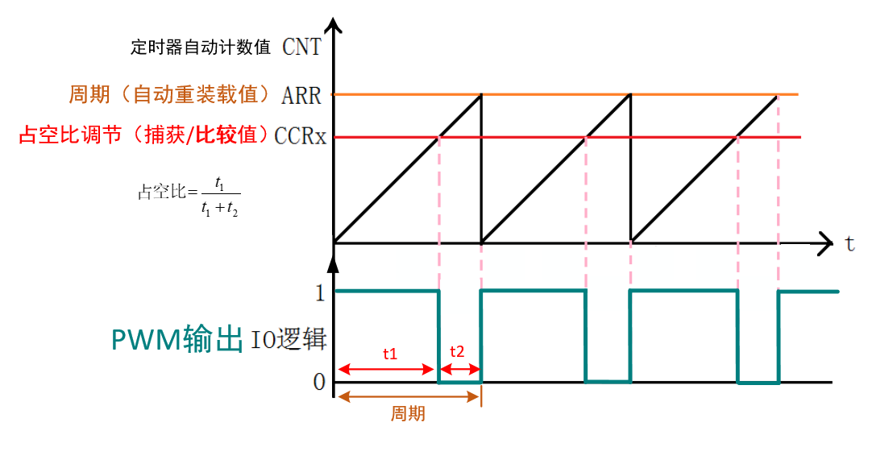
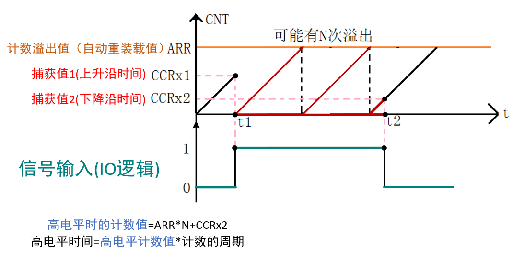
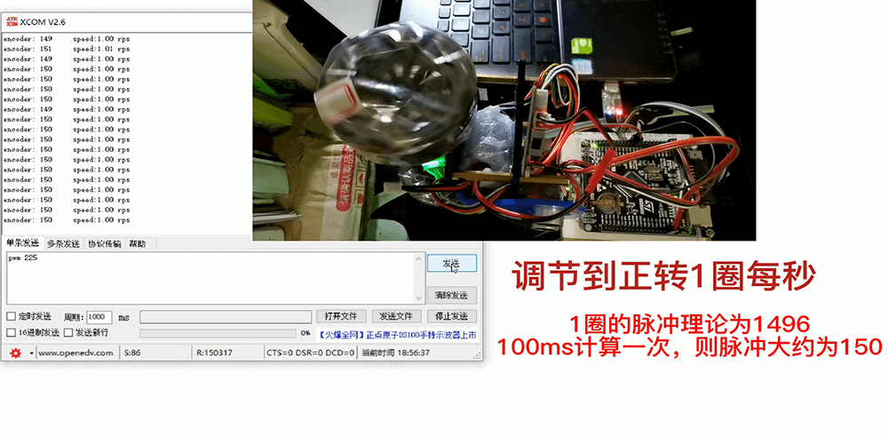
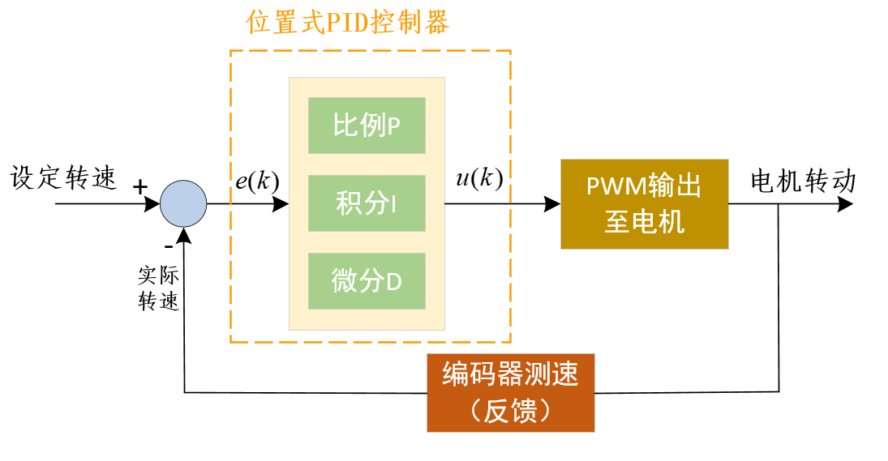
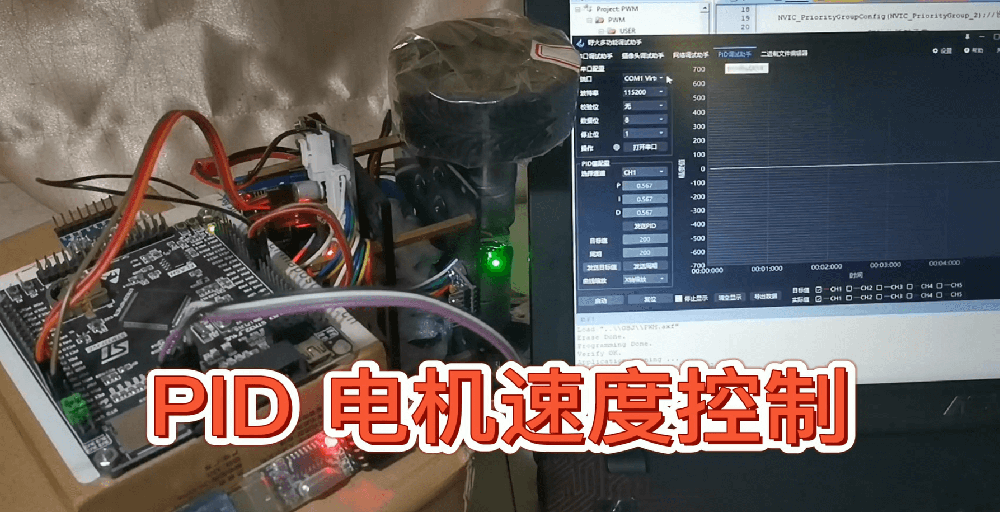
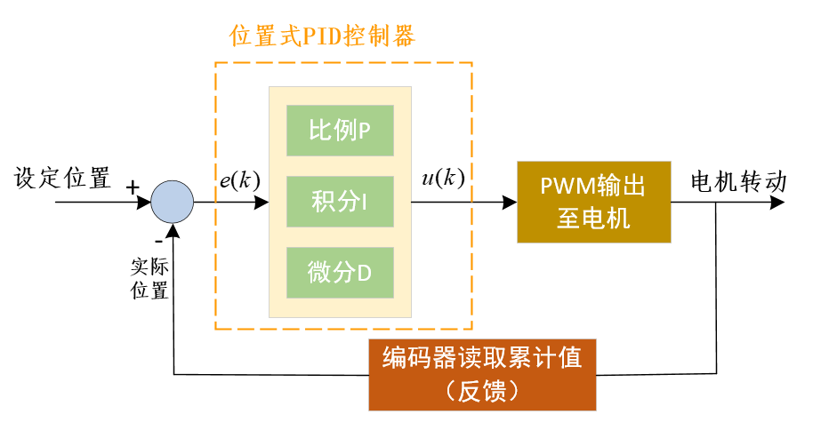
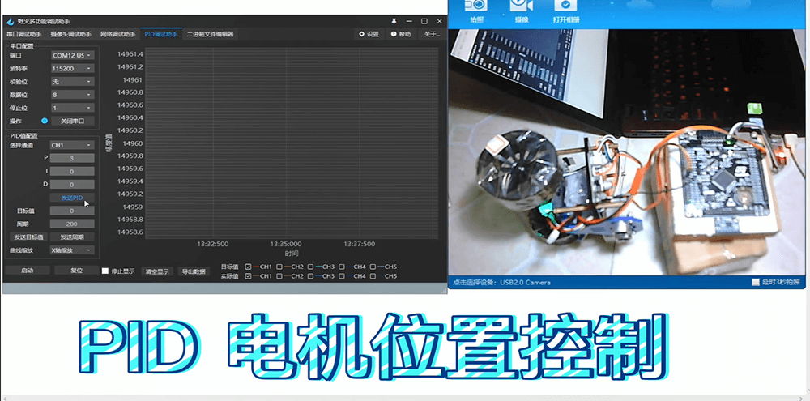
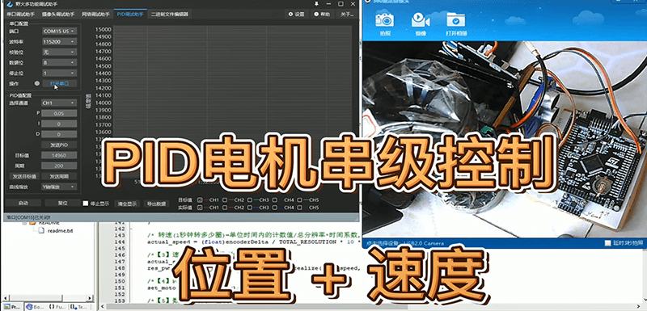

# stm32-motor-pid

#### 介绍
从PWM输出、正交编码器测速到PID速度环、位置环、串级控制...

#### 板子信息

本项目使用STM32F407VET6开发板进行实验

#### 项目结构

预先阅读文章：[编码器计数原理与电机测速原理——多图解析](https://zhuanlan.zhihu.com/p/350368518)

#####  实验1 PWM输出实验

文章：[电机控制基础——定时器基础知识与PWM输出原理](https://zhuanlan.zhihu.com/p/351564974)

#####  实验2 输入捕获实验

文章：[电机控制基础——定时器捕获单输入脉冲原理](https://zhuanlan.zhihu.com/p/353482805)

#####  实验3 正交编码器实验

文章：[电机控制基础——定时器编码器模式使用与转速计算](https://zhuanlan.zhihu.com/p/355346491)

视频：<https://www.bilibili.com/video/BV13p4y1h7F9?share_source=copy_web>

#####  实验4 速度控制PID

文章：[电机控制进阶1——PID速度控制](https://zhuanlan.zhihu.com/p/373402745)

视频：<https://www.bilibili.com/video/BV18Q4y1R7e8?share_source=copy_web>

#####  实验5 位置控制PID

文章：[电机控制进阶2——PID位置控制](https://zhuanlan.zhihu.com/p/374961047)

视频：<https://www.bilibili.com/video/BV1ZK4y1976i?share_source=copy_web>

#####  实验6 串级PID 位置+速度控制

文章：整理中...

视频：<https://www.bilibili.com/video/BV1QK4y1g7yg?share_source=copy_web>

#### 软件工具

tools文件夹下：

- 野火多功能调试助手（可以调试PID）
- 正点原子的XCOM串口助手

#### 推荐学习

- B站相关视频：<https://space.bilibili.com/146899653>
- 个人博客：<https://xxpcb.gitee.io> ,<https://xxpcb.github.io>
- 知乎：<https://www.zhihu.com/people/xxpcb>
- 微信公众文章：

感谢支持~

