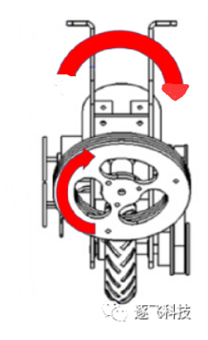
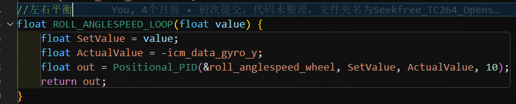
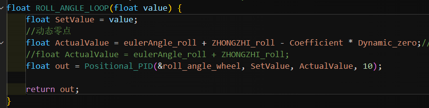
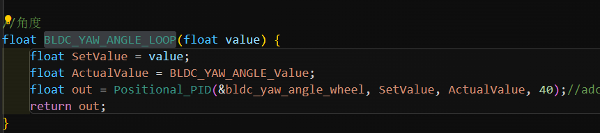

# 前言
> 阅读本文前，请确保自己拥有最基本的PID，串级PID，动量守恒定律相关领域的基本知识。
>
> 推荐阅读：独轮组之逐飞演示车模浅析https://mp.weixin.qq.com/s/o81oUH_KNcz3slRfC4oMRw

独轮车由于对于地面只有一个接触点,我们需要完成roll,pitch,yaw三个轴的平衡控制才能完成独轮的基本控制任务.本文暂且不考虑roll轴压弯对yaw轴的辅助转向作用,考虑这三个控制系统相互独立,我们分开进行相关讨论.

# 平衡控制概述
## pitch轴
pitch轴是与动量轮无关的一个运动轴,我们在假设roll,yaw完全锁死的情况下,他仅依靠前进电机本身完成所有的平衡操作。
在这种情况下,pitch轴的运动控制完全等同于平衡小车。
控制代码结构与调参思路可以完全参考【【平衡小车PID】直立环+速度环完整调参过程 (开源)】 https://www.bilibili.com/video/BV1zo4y1D7bx

> 本文不对平衡小车的pitch轴相关控制思路进行讲解，一般的控制思路就是直立环+速度环，网上很好的教程很多，我就不在这里浪费时间了，请各位读者自行寻找资料。

## roll轴

如上图，若是动量轮同时进行顺时针旋转，则由于动量守恒定律，车辆将会 ***逆时针***  旋转。宏观上，当我们车辆发生朝右的倾斜时，只需要我动量轮的顺时针旋转速度增大，即可让车辆回正。

## yaw轴

同理，当动量轮以上图旋转时，车辆将在yaw轴上逆时针旋转（即上图的车辆将发生左转行为），为了不让我们yaw轴的旋转影响roll轴本身的平衡，我们会对两个动量轮施加图中视角反向但等大的力，这样roll轴的动量由两个动量轮本身负责了抵消，车辆也完成了yaw轴转向的动作。

# 平衡控制算法代码详解

> 请提前阅读逐飞独轮控制开源:独轮组之逐飞演示车模浅析https://mp.weixin.qq.com/s/o81oUH_KNcz3slRfC4oMRw

我们首先理解一下我们车辆最基本的几个数据参数.

首先,我们需要分开讨论两套控制系统,独轮车的有刷电机控制的是pitch轴的平衡,yaw和roll轴的平衡完全由无刷电机动量轮控制,我们把这两个情况完全隔离成两个控制系统才能清晰明了的讨论出控制框架来.
## 动量轮部分代码解析
针对动量轮的控制系统,我们有以下已知参数:

1. 动量轮的转速
2. 陀螺仪的回传的角速度和角加速度
3. 根据陀螺仪回传的数据解算出的车辆自身角度

这些参数的优先级如下图所示:

由此,我们确定了串级pid的内外环顺序.

在time.c中,我们可以看到根据一个1ms定时器所编写的中断服务函数,其中我们分为2ms,10ms,20ms的不同控制周期编写了内外环.

### 2ms环(角速度环)
值得注意的是,这里的角速度指的是陀螺仪的角速度而不是动量轮的角速度,请勿混淆.

我们把yaw轴和roll轴的动量轮最终旋转方向分开计算,最终叠加,可以达到yaw&roll两轴不会互相影响的效果.

可以看到,ROLL_ANGLESPEED_LOOP函数是一个简单的pid计算函数,他的目标值是我们所设定的pidout_2f,实际值是我们的陀螺仪角速度.
这里也符合了我们串级pid的最基本的思维,**内环的目标值是外环的输出**.
串级pid的最终输出有内环直接作用于pwm上,于是可以看到

这里的pidout_3b中的"3","6"即是roll和yaw轴串级pid三环的最内环.下文中的"1""4"是最外环.

b寓意为back,f寓意为front,区分前后两个动量轮.

我们继续看串级pid,刚刚我们完成了最内环的讲解,现在往外一层,即是我们的角度环.

### 10ms环(角度环)

ROLL_ANGLE_LOOP的目标值为最外环的输出值,实际值有点复杂,这里的eulerAngle_roll为车辆实际roll轴角度,ZHONGZHI_roll为中值补偿,它可以控制车辆平衡点的位置,Coefficient * Dynamic_zero为一个动态零点的数据,方便独轮车压弯,这里暂将该参数忽略即可.

BLDC_YAW_ANGLE_LOOP的实际值为车辆偏差值,在导航模式下也为目标导航点的角度偏差,在当前框架下我们将这个值看为当前车辆的yaw轴离目标yaw轴的偏差值即可,通过pid的单位换算我们可以基本将摄像头或者电磁的偏差值视为yaw轴的偏差值.

### 20ms环(速度环)

速度环为最外环,他的目标值是0.
这里怎么理解呢,因为我们的速度环是最外环,且roll轴必须是**正反馈**.

很多同学就会疑问,为什么这里是正反馈呢,我是这样理解的,我们需要一个外环正反馈使动量轮尽快的到达目标点,利用另一边的重力分量尽快的让我们动量轮积蓄的转速消耗掉,因为我们的roll轴力矩的传递实际上不是由速度来给的,而是加速度,我们如果车辆要维持一个非平衡状态势必需要一个恒定的加速度来抵消重力的分力,但我们的动量轮转速存在一个上限值,也就是大家常说的动量轮饱和,所以当我们的车辆向左倾斜的时候,我们需要尽快的让车辆向右倾斜,这样才可以在动量轮达到饱和之前让动量轮速度重新慢下来.

但是,笔者的yaw轴才用的是**负反馈**,究其原因是笔者想通过行进电机的静摩擦力达到消耗动量轮转向饱和的目的,由于时间关系这个控制系统没有完美的从理论上验证成功,虽然最后的效果还不错.

至此为止,动量轮控制的roll&yaw系统已经介绍完毕了,需要非常非常注意到是,请大家在构建自己的串级pid控制系统的时候务必分清楚实际值传入后 **需不需要加负号?**  **最后达到的pid控制是正反馈还是负反馈?** ,在 逐飞的推文中详细描述了pid的调试过程.

> 总结:可能第一次读到这里的读者会有一种迷迷糊糊,不知所云的感觉,这是正常的,独轮车的控制系统本身就是一个较为复杂的串级pid框架,大家可以从最内环入手,渐渐地感受动量轮带来的阻尼感,结合逐飞的推文写出自己的代码,同时参考这套代码验证自己的一些想法.有任何问题可以在群里艾特我.