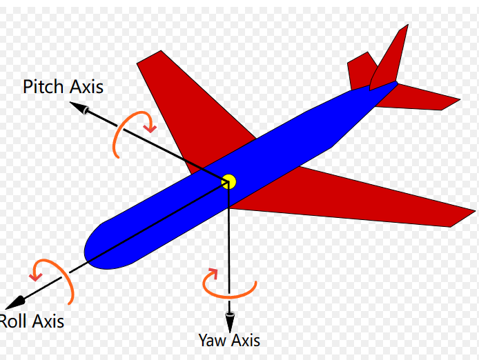
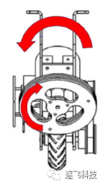

# 前言
> 阅读本文前，请确保自己拥有最基本的PID，串级PID，动量守恒定律相关领域的基本知识。
>
> 推荐阅读：独轮组之逐飞演示车模浅析https://mp.weixin.qq.com/s/o81oUH_KNcz3slRfC4oMRw

独轮车由于对于地面只有一个接触点,我们需要完成roll,pitch,yaw三个轴的平衡控制才能完成独轮的基本控制任务.本文暂且不考虑roll轴压弯对yaw轴的辅助转向作用,考虑这三个控制系统相互独立,我们分开进行相关讨论.

# 平衡控制概述
## pitch轴
pitch轴是与动量轮无关的一个运动轴,我们在假设roll,yaw完全锁死的情况下,他仅依靠前进电机本身完成所有的平衡操作。
在这种情况下,pitch轴的运动控制完全等同于平衡小车。
控制代码结构与调参思路可以完全参考【【平衡小车PID】直立环+速度环完整调参过程 (开源)】 https://www.bilibili.com/video/BV1zo4y1D7bx

> 本文不对平衡小车的pitch轴相关控制思路进行讲解，一般的控制思路就是直立环+速度环，网上很好的教程很多，我就不在这里浪费时间了，请各位读者自行寻找资料。

## roll轴

如上图，若是动量轮同时进行顺时针旋转，则由于动量守恒定律，车辆将会 ***逆时针***  旋转。宏观上，当我们车辆发生朝右的倾斜时，只需要我动量轮的顺时针旋转速度增大，即有一个顺时针旋转的加速度，即可让车辆回正。

## yaw轴

同理，当动量轮以上图旋转时，车辆将在yaw轴上逆时针旋转（即上图的车辆将发生左转行为），为了不让我们yaw轴的旋转影响roll轴本身的平衡，我们会对两个动量轮施加图中视角反向但等大的力，这样roll轴的动量由两个动量轮本身负责了抵消，车辆也完成了yaw轴转向的动作。

# 平衡控制算法代码详解

> 待更新